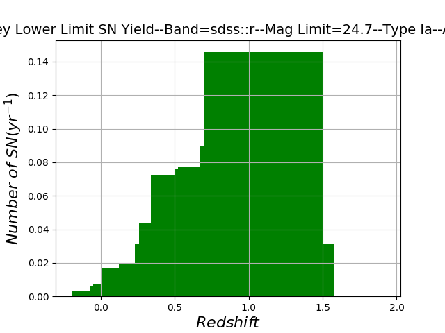

****************************
Simulating a Targeted Survey
****************************

Creating an Targeted Survey
===========================

For a targeted survey search, use the following example:

		
.. code-block:: python     
	
     from __future__ import print_function
     import surveySim
     from astropy import units as u
     slacs=surveySim.survey(name='SLACS',snTypes=['Ia','Ib','Ic','IIP'])
     slacs.cadence=3*u.day
     slacs.magLimits=[24.7]
     slacs.filters=['sdss::r']
     slacs.surveyLength=1*u.year
     slacs.galaxies=surveySim.load_example_data()
     slacs.targetedSurvey(zpsys='ab')
     print(slacs)
     slacs.plotHist('sdss::r','Ia')
     

Out::
  
   Survey Name:SLACS
		Length: 1.0 Year
		Cadence: 3.0 Days
		Number of Galaxies: 110
		Redshift Range: 0.2-->1.52
		-------------------
   Filter=sdss::r, Limiting Magnitude=24.7
		Upper Bound Ia:103.2
		Lower Bound Ia:1.45
		Upper Bound Ic:2.89
		Lower Bound Ic:0.29
		Upper Bound Ib:4.17
		Lower Bound Ib:0.41
		Upper Bound IIP:0.86
		Lower Bound IIP:0.08

		Total Ia Upper Bound:103.2
		Total Ia Lower Bound:1.45
		Total CC Upper Bound:7.92
		Total CC Lower Bound:0.78

		Total Lower Bound:2.23
		Total Upper Bound:111.12
		-------------------

Plot the Results in a Histogram
===============================
You can directly plot a specific band from the result Dictionary::
  
  slacs.plotHist('sdss::i','Ia')
  

Out:

